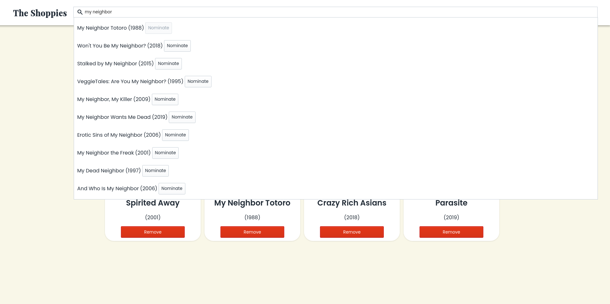
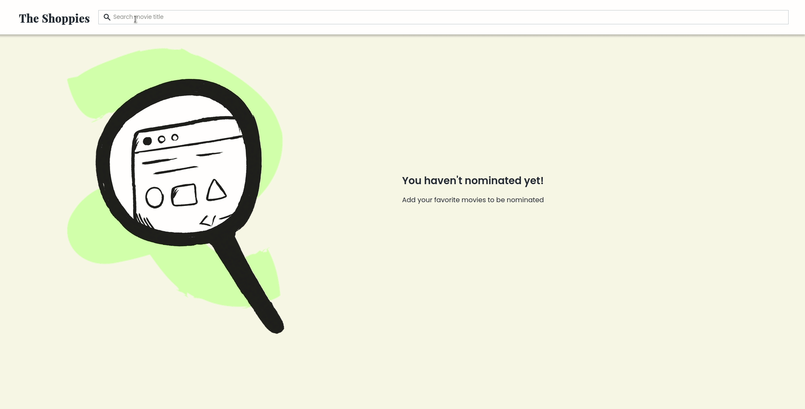
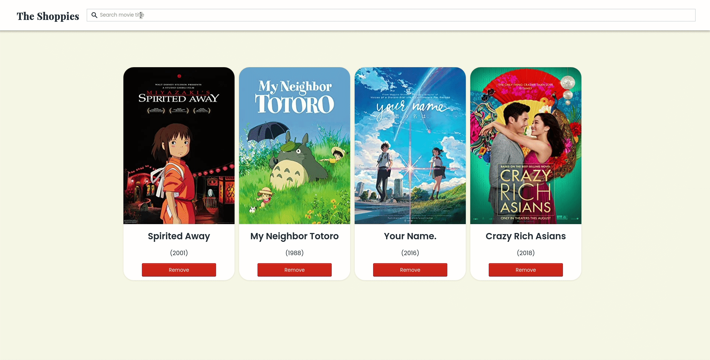

# Shoppies OMDB Nomination

This project was bootstrapped with [Create React App](https://github.com/facebook/create-react-app), using the [Redux](https://redux.js.org/) and [Redux Toolkit](https://redux-toolkit.js.org/) template.

Page: https://omdb-shafiya.vercel.app/

Example share link page: https://omdb-shafiya.vercel.app/share/tt0096283-tt0347149-tt5311514-tt5323662-tt0245429

## Flow

At first, I didn't understand some of the technical requirements. I nearly skipped a little detail so I think it may be better to write them down.

Steps:

1. User clicks the website
2. There will be `The Shoppies` sign and search box.
3. User can type on search box and it will show search results based on what user types. Each result has at least title, year, and button `Nominate`.
4. User can click `Nominate` and it will be added to Nomination List. If it is already nominated, the `Nominate` button will be disabled.
5. User can remove one of nominated movie from nomination list.
6. When user has 5 nominations, show banner.

Improvement:

- Improved the design and showed image in nomination list. I handled a case if the image of movie is not available.
- Give some toasts when you click `Nominate` button on search box, `Remove`, and `Share link` button.
- Nomination list will be saved to local storage (using Redux Persist) so users won't have to worry if they accidentally exit the tab
- Add share link feature.

## Technical decisions:

- I use React because I am very comfortable using it. I use Redux for state management because I want to practice using it. Because I use Redux, I complemented it with Redux Persist to save the state to local storage.
- I only use CSS (not Sass, styled-components, Tailwind, etc) since I miss writing vanilla CSS <3
- I use `react-hot-toast` for showing toast
- You can see from the API search, each movie has an unique `ImdbID`. We can also get movie data from its `ImdbID`, so I think I could use it to implement share link feature. The idea is that it will read URL that consists of ImdbIDs (e.g. https://omdb-shafiya.vercel.app/share/tt0096283-tt0347149-tt5311514-tt5323662-tt0245429) and it will render based on the IDs.

## Screenshot:

- If a movie is already on Nomination List, the `Nominate` button will be disabled
  
- You can nominate a movie by searching on search box and clicking `Nominate` button. It will show toast that the movie is successfully added. You can also delete the movie by clicking `Remove` button and it will show toast that the movie is successfully deleted.
  
- You can only add five movies to be nominated. When you already have 5 nominations, it will show banner that you have added 5 nominations. There is a `Share link` button and if it is clicked, the link will be copied to the clipboard and the nomination list can be shared with your friend.
  
- Copy the link to your browser. It will show your friend's nomination list. You can also nominate as well! You don't have to worry if you exit the tab, because it will be saved to your local storage.
  
